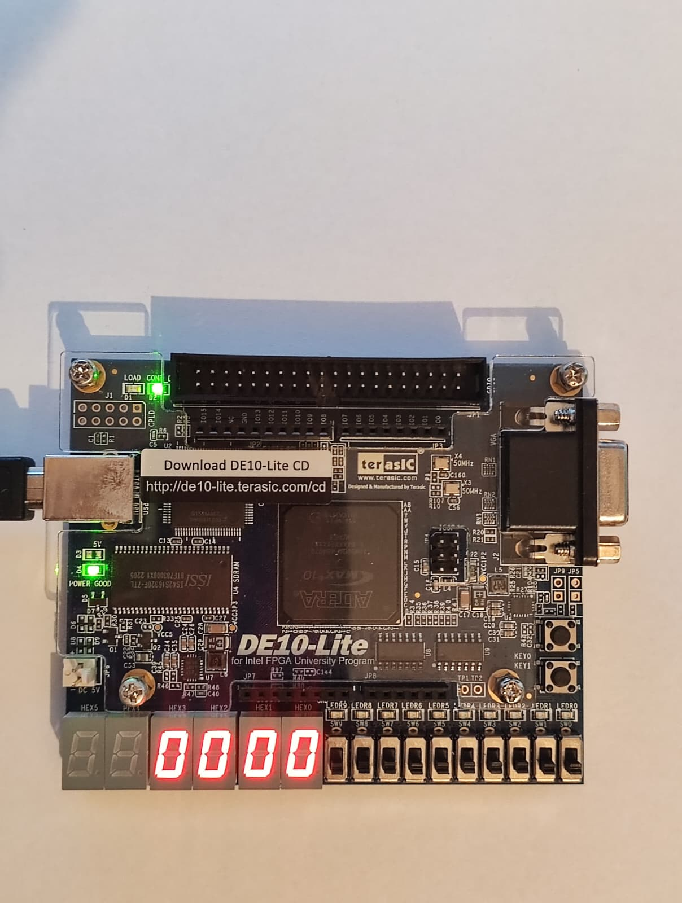
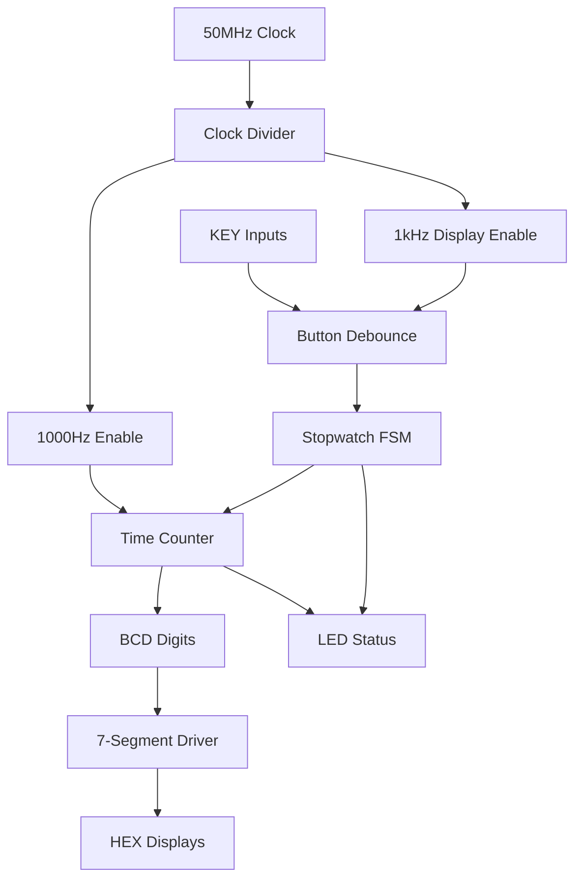

# Digital Stopwatch for Intel DE10-Lite FPGA


A fully functional digital stopwatch implementation in Verilog HDL for the Intel DE10-Lite FPGA development board. Features precision timing with millisecond accuracy, debounced inputs, and a clean 7-segment display interface.

## Demo

### Hardware Implementation


### Stopwatch in Action

[](videos/stopwatch-display.mp4)

*Click the image above to view the video showing 7-segment displays in SS.ms format*

### Video Demonstration

[](videos/stopwatch-demo.mp4)

*Click the image above to view the full demonstration video*

> **Tip:** To watch the videos, clone the repository and open the files in the `videos/` folder, or click the links above to download them.

## Features

- **High Precision Timing**: 1000Hz (millisecond) accurate timebase derived from 50MHz clock
- **SS.ms Display**: Time format from 00.00 to 59.99 (seconds.hundredths) with decimal point
- **Start/Pause/Resume**: Full stopwatch functionality with precision timing
- **Instant Reset**: Reset to 00.00 from any state
- **LED Status Indicators**: Visual feedback for running, paused, and max time states
- **Debounced Inputs**: 20ms debounce with metastability protection
- **Single Clock Domain Design**: Proper FPGA design using clock enables
- **Hardware Tested**: Verified on Intel DE10-Lite board

## Table of Contents

- [Demo](#-demo)
- [Features](#-features)
- [Hardware Requirements](#-hardware-requirements)
- [Getting Started](#-getting-started)
- [Usage](#-usage)
- [Architecture](#-architecture)
- [Pin Configuration](#-pin-configuration)
- [Performance](#-performance)
- [Project Structure](#-project-structure)
- [Contributing](#-contributing)
- [License](#-license)

## Hardware Requirements

| Component | Specification |
|-----------|---------------|
| **FPGA Board** | Intel DE10-Lite (MAX 10 FPGA) |
| **Device** | 10M50DAF484C6GES |
| **Clock** | 50 MHz oscillator |
| **Displays** | 4× 7-segment displays (on-board) |
| **LEDs** | 10× Red LEDs (LEDR0-LEDR9) |
| **Inputs** | 2× Push buttons (KEY0, KEY1) |
| **Programmer** | USB-Blaster compatible |

## Getting Started

### Prerequisites
- [Intel Quartus Prime Lite](https://www.intel.com/content/www/us/en/software/programmable/quartus-prime/download.html) (v20.1 or later)
- Intel DE10-Lite FPGA board
- USB-Blaster programmer cable

### Installation

1. **Clone the repository**
   ```bash
   git clone https://github.com/yourusername/STOPWATCH-Intel-DE10-Lite-FPGA.git
   cd STOPWATCH-Intel-DE10-Lite-FPGA
   ```

2. **Open in Quartus**
   ```bash
   # Open the project file
   quartus QuartusProjectStopWatch.qpf
   ```

3. **Compile the design**
   - In Quartus: `Processing` → `Start Compilation`
   - Or press `Ctrl+Shift+B`

4. **Program the FPGA**
   - Connect DE10-Lite via USB-Blaster
   - `Tools` → `Programmer`
   - Load `output_files/QuartusProjectStopWatch.sof`
   - Click `Start`

## Usage

### Basic Operation

| Button | Location | Function |
|--------|----------|----------|
| **KEY0** | Lower | Start/Pause toggle |
| **KEY1** | Upper | Reset to 00.00 |

### LED Status Indicators

| LED | Function |
|-----|----------|
| **LEDR[0]** | Blinks (2 Hz) when stopwatch is running |
| **LEDR[1]** | Solid ON when stopwatch is paused |
| **LEDR[9]** | ON when max time reached (59.99) |

### Display Format

```
  HEX3   HEX2   HEX1   HEX0
 ┌─────┐┌─────┐┌─────┐┌─────┐
 │  5  ││  9. ││  9  ││  9  │
 └─────┘└─────┘└─────┘└─────┘
    └─seconds─┘└──10ms units──┘
```

The decimal point on HEX2 separates seconds from the fractional part (displayed in 10ms increments).

### Operation Flow

1. **Power On**: Display shows `00.00`
2. **Start**: Press `KEY0` (lower button) → Counter begins (increments every 10ms)
3. **Pause**: Press `KEY0` again → Counter freezes
4. **Resume**: Press `KEY0` again → Counter continues
5. **Reset**: Press `KEY1` (upper) → Returns to `00.00`

### Example Usage Sequence

```
Initial State:    00.00
Press KEY0:       00.01 → 00.02 → 00.03 ... (each step = 10ms)
Press KEY0:       15.47 (paused at 15.47 seconds)
Press KEY0:       15.48 → 15.49 ... (resumed)
Press KEY1:       00.00 (reset)
```

## Architecture

The stopwatch is implemented using a modular architecture with clear separation of concerns.

### Core Modules



### Module Descriptions

| Module | Purpose | Key Features |
|--------|---------|--------------|
| `clock_divider.v` | Clock enable generation | 50MHz → 1000Hz enable pulses |
| `button_debounce.v` | Input conditioning | Metastability protection, 20ms debounce |
| `stopwatch_fsm.v` | State machine | IDLE/RUN/PAUSE states with edge detection |
| `time_counter.v` | Time tracking | Cascaded BCD counters (no division) |
| `seg7_driver.v` | Display interface | BCD to 7-segment decoder |
| `stopwatch_top.v` | System integration | Top-level connections + LED status |
| `DE10_LITE_Golden_Top.v` | Board wrapper | Pin assignments and I/O mapping |

## Pin Configuration

### Clock and Control
| Signal | Pin | Description |
|--------|-----|-------------|
| `MAX10_CLK1_50` | P11 | 50MHz system clock |
| `KEY[0]` | B8 | Start/Pause button (active-low) |
| `KEY[1]` | A7 | Reset button (active-low) |

### 7-Segment Displays
| Display | Segments | Pins | Function |
|---------|----------|------|----------|
| `HEX0` | [7:0] | C14,E15,C15,C16,E16,D17,C17,D15 | 10ms digit (0-9) |
| `HEX1` | [7:0] | C18,D18,E18,B16,A17,A18,B17,A16 | 100ms digit (0-9) |
| `HEX2` | [7:0] | B20,A20,B19,A21,B21,C22,B22,F21 | Seconds ones (with decimal point) |
| `HEX3` | [7:0] | F21,E22,E21,C19,C20,D19,E17,F18 | Seconds tens |

### LED Indicators
| LED | Pin | Function |
|-----|-----|----------|
| `LEDR[0]` | A8 | Running indicator (blinks at 2 Hz) |
| `LEDR[1]` | A9 | Paused indicator (solid) |
| `LEDR[9]` | B11 | Max time reached (59.99) |

## Performance

### Timing Specifications
- **Clock Accuracy**: ±0.002% (derived from 50MHz crystal)
- **Time Resolution**: 10 milliseconds (0.01 seconds)
- **Display Range**: 00.00 to 59.99 seconds
- **Button Response**: <20ms debounce delay
- **Display Update**: Static (no refresh needed)
- **LED Blink Rate**: 2 Hz when running

### Design Features
- **Single Clock Domain**: All logic uses 50 MHz with clock enables
- **No Generated Clocks**: Uses enable pulses for timing
- **Cascaded BCD Counters**: Efficient digit counting without division
- **Metastability Protection**: 2-stage synchronizers on async inputs

### Resource Utilization
| Resource | Used | Available | Utilization |
|----------|------|-----------|-------------|
| Logic Elements | ~200 | 49,760 | <1% |
| Registers | ~100 | 49,760 | <1% |
| Memory Bits | 0 | 1,677,312 | 0% |
| Pins | 52 | 360 | 14% |

## Project Structure

```
STOPWATCH-Intel-DE10-Lite-FPGA/
├── images/                          # Photos and diagrams
│   └── board-setup.jpeg
├── videos/                          # Demonstration videos
│   ├── stopwatch-demo.mp4
│   └── stopwatch-display.mp4
├── docs/                            # Additional documentation
│   └── timing-analysis.pdf
├── stopwatch_top.v                 # Main integration module
├── clock_divider.v                 # Clock generation
├── button_debounce.v               # Input debouncing
├── stopwatch_fsm.v                 # State machine
├── time_counter.v                  # Counter logic
├── seg7_driver.v                   # Display driver
├── DE10_LITE_Golden_Top.v          # Board wrapper
├── QuartusProjectStopWatch.qpf     # Quartus project
├── .gitignore                      # Git exclusions
├── LICENSE                         # MIT License
└── README.md                       # This file
```

### Development Setup
1. Fork the repository
2. Create a feature branch (`git checkout -b feature/AmazingFeature`)
3. Make your changes
4. Test on hardware
5. Commit your changes (`git commit -m 'Add AmazingFeature'`)
6. Push to the branch (`git push origin feature/AmazingFeature`)
7. Open a Pull Request


---

