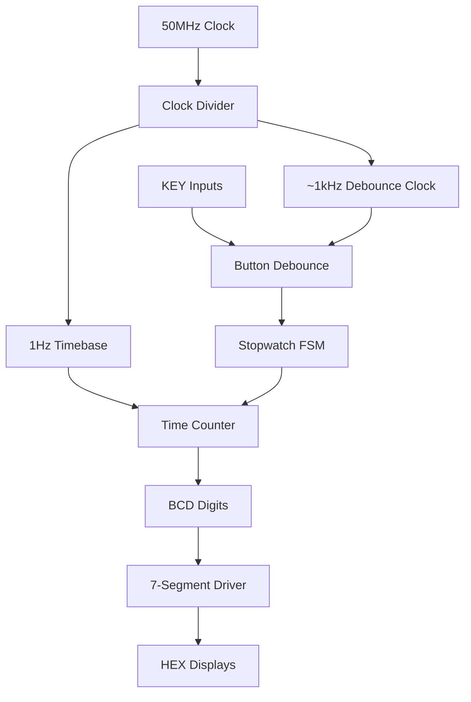

# 🕐 Digital Stopwatch for Intel DE10-Lite FPGA


A fully functional digital stopwatch implementation in Verilog HDL for the Intel DE10-Lite FPGA development board. Features precision timing with centisecond accuracy, debounced inputs, and a clean 7-segment display interface.

## 📸 Demo

<!-- Add your photos/videos here -->
### Hardware Implementation

*DE10-Lite FPGA board showing the stopwatch in operation*

### Stopwatch in Action

*7-segment displays showing SS.CS format (example: 32.45 = 32 seconds, 45 centiseconds)*

### Video Demonstration
[](videos/stopwatch-demo.mp4)
*Click to watch the stopwatch demonstration*

## 🎯 Features

- ✅ **High Precision Timing**: 100Hz (centisecond) accurate timebase derived from 50MHz clock
- ✅ **SS.CS Display**: Time format from 00.00 to 59.99 (seconds.centiseconds)
- ✅ **Start/Pause/Resume**: Full stopwatch functionality with precision timing
- ✅ **Instant Reset**: Reset to 00.00 from any state
- ✅ **Debounced Inputs**: 20ms debounce with metastability protection
- ✅ **Hardware Tested**: Verified on Intel DE10-Lite board

## 📋 Table of Contents

- [Demo](#-demo)
- [Features](#-features)
- [Hardware Requirements](#-hardware-requirements)
- [Getting Started](#-getting-started)
- [Usage](#-usage)
- [Architecture](#-architecture)
- [Pin Configuration](#-pin-configuration)
- [Performance](#-performance)
- [Project Structure](#-project-structure)
- [Contributing](#-contributing)
- [License](#-license)

## 🔧 Hardware Requirements

| Component | Specification |
|-----------|---------------|
| **FPGA Board** | Intel DE10-Lite (MAX 10 FPGA) |
| **Device** | 10M50DAF484C6GES |
| **Clock** | 50 MHz oscillator |
| **Displays** | 4× 7-segment displays (on-board) |
| **Inputs** | 2× Push buttons (KEY0, KEY1) |
| **Programmer** | USB-Blaster compatible |

## 🚀 Getting Started

### Prerequisites
- [Intel Quartus Prime Lite](https://www.intel.com/content/www/us/en/software/programmable/quartus-prime/download.html) (v20.1 or later)
- Intel DE10-Lite FPGA board
- USB-Blaster programmer cable

### Installation

1. **Clone the repository**
   ```bash
   git clone https://github.com/yourusername/STOPWATCH-Intel-DE10-Lite-FPGA.git
   cd STOPWATCH-Intel-DE10-Lite-FPGA
   ```

2. **Open in Quartus**
   ```bash
   # Open the project file
   quartus QuartusProjectStopWatch.qpf
   ```

3. **Compile the design**
   - In Quartus: `Processing` → `Start Compilation`
   - Or press `Ctrl+Shift+B`

4. **Program the FPGA**
   - Connect DE10-Lite via USB-Blaster
   - `Tools` → `Programmer`
   - Load `output_files/QuartusProjectStopWatch.sof`
   - Click `Start`

## 🎮 Usage

### Basic Operation


*Button layout on DE10-Lite board*

| Button | Location | Function |
|--------|----------|----------|
| **KEY0** | Lower | Start/Pause toggle |
| **KEY1** | Upper | Reset to 00.00 |

### Operation Flow

1. **🔌 Power On**: Display shows `00.00`
2. **▶️ Start**: Press `KEY0` (lower button) → Counter begins (increments by 0.01s)
3. **⏸️ Pause**: Press `KEY0` again → Counter freezes
4. **▶️ Resume**: Press `KEY0` again → Counter continues
5. **🔄 Reset**: Press `KEY1` (upper) → Returns to `00.00`

### Example Usage Sequence

```
Initial State:    00.00
Press KEY0:       00.01 → 00.02 → 00.03 ... (counting in centiseconds)
Press KEY0:       15.47 (paused)
Press KEY0:       15.48 → 15.49 ... (resumed)
Press KEY1:       00.00 (reset)
```

## 🏗️ Architecture

The stopwatch is implemented using a modular architecture with clear separation of concerns:


*High-level system architecture*

### Core Modules



### Module Descriptions

| Module | Purpose | Key Features |
|--------|---------|--------------|
| `clock_divider.v` | Clock generation | 50MHz → 100Hz + debounce clock |
| `button_debounce.v` | Input conditioning | Metastability protection, 20ms debounce |
| `stopwatch_fsm.v` | State machine | IDLE/RUN/PAUSE states with edge detection |
| `time_counter.v` | Time tracking | Centisecond counter with digit decomposition |
| `seg7_driver.v` | Display interface | BCD to 7-segment decoder |
| `stopwatch_top.v` | System integration | Top-level module connections |

## 📌 Pin Configuration

### Clock and Control
| Signal | Pin | Description |
|--------|-----|-------------|
| `MAX10_CLK1_50` | P11 | 50MHz system clock |
| `KEY[0]` | B8 | Start/Pause button (active-low) |
| `KEY[1]` | A7 | Reset button (active-low) |

### 7-Segment Displays
| Display | Segments | Pins | Function |
|---------|----------|------|----------|
| `HEX0` | [7:0] | C14,E15,C15,C16,E16,D17,C17,D15 | Centiseconds (ones) |
| `HEX1` | [7:0] | C18,D18,E18,B16,A17,A18,B17,A16 | Centiseconds (tens) |
| `HEX2` | [7:0] | B20,A20,B19,A21,B21,C22,B22,F21 | Seconds (ones) |
| `HEX3` | [7:0] | F21,E22,E21,C19,C20,D19,E17,F18 | Seconds (tens) |

## ⚡ Performance

### Timing Specifications
- **Clock Accuracy**: ±0.002% (derived from 50MHz crystal)
- **Time Resolution**: 0.01 seconds (centiseconds)
- **Maximum Count**: 59.99 (59 seconds, 99 centiseconds)
- **Button Response**: <20ms debounce delay
- **Display Update**: Static (no refresh needed)

### Resource Utilization
| Resource | Used | Available | Utilization |
|----------|------|-----------|-------------|
| Logic Elements | ~150 | 49,760 | <1% |
| Registers | ~80 | 49,760 | <1% |
| Memory Bits | 0 | 1,677,312 | 0% |
| Pins | 42 | 360 | 12% |

## 📁 Project Structure

```
STOPWATCH-Intel-DE10-Lite-FPGA/
├── 📁 images/                          # Photos and diagrams
│   ├── board-setup.jpg
│   ├── stopwatch-display.jpg
│   ├── button-layout.jpg
│   └── architecture-diagram.png
├── 📁 videos/                          # Demonstration videos
│   └── stopwatch-demo.mp4
├── 📁 docs/                            # Additional documentation
│   └── timing-analysis.pdf
├── 📄 stopwatch_top.v                 # Main integration module
├── 📄 clock_divider.v                 # Clock generation
├── 📄 button_debounce.v               # Input debouncing
├── 📄 stopwatch_fsm.v                 # State machine
├── 📄 time_counter.v                  # Counter logic
├── 📄 seg7_driver.v                   # Display driver
├── 📄 DE10_LITE_Golden_Top.v          # Board wrapper
├── 📄 QuartusProjectStopWatch.qpf     # Quartus project
├── 📄 .gitignore                      # Git exclusions
├── 📄 LICENSE                         # MIT License
└── 📄 README.md                       # This file
```

## 🤝 Contributing

Contributions are welcome! Please feel free to submit a Pull Request.

### Development Setup
1. Fork the repository
2. Create a feature branch (`git checkout -b feature/AmazingFeature`)
3. Make your changes
4. Test on hardware
5. Commit your changes (`git commit -m 'Add AmazingFeature'`)
6. Push to the branch (`git push origin feature/AmazingFeature`)
7. Open a Pull Request


---

